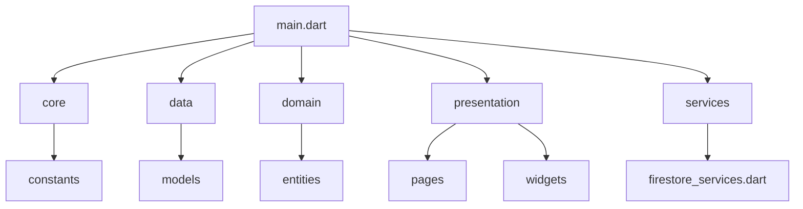

# 🌍 WORLD QUEST 🚩

<div align="center">
  
  
  
  [](https://flutter.dev/)
  [](https://firebase.google.com/)
  [](LICENSE)
  [](http://makeapullrequest.com)
  
  ### 🧠 Dünya bayraklarını öğrenmenin en eğlenceli yolu! 🎯
  ### 190+ ülke | 3 Oyun Modu | Çoklu Kategori

</div>

## ✨ Neden World Quest?

> *"Coğrafyayı bilmek, tarihimizi, kültürümüzü ve dünyayı anlamaktır."*

**World Quest**, dünya bayraklarını tanıma ve öğrenme becerinizi geliştirmenizi sağlayan, hem eğlenceli hem de eğitici bir Flutter mobil uygulamasıdır. Farklı oyun modları, kıtasal kategoriler ve zorluk seviyeleri ile 190'dan fazla ülke bayrağını keşfedin!

<div align="center">
  <table>
    <tr>
      <td align="center"><b>🎮 Eğlencelidir</b></td>
      <td align="center"><b>🧠 Öğreticidir</b></td>
      <td align="center"><b>🚀 Hızlıdır</b></td>
      <td align="center"><b>🔄 Çeşitlidir</b></td>
    </tr>
    <tr>
      <td align="center">Rekabet et, puanları karşılaştır</td>
      <td align="center">190+ ülke bayrağı hakkında bilgi edin</td>
      <td align="center">Hızlı oyun deneyimi</td>
      <td align="center">Farklı mod ve kategoriler</td>
    </tr>
  </table>
</div>

## 🎮 Oyun Modları

<table>
  <tr>
    <td width="33%" align="center">
      <br/>
      <b>🔵 Klasik Mod</b><br/>
      <small>10 soruda ne kadar doğru cevap verebilirsin? Her soru için süren var!</small>
    </td>
    <td width="33%" align="center">
      <br/>
      <b>⏱️ Zaman Yarışı</b><br/>
      <small>60 saniye içinde kaç bayrağı doğru tahmin edebilirsin? Zamanla yarış!</small>
    </td>
    <td width="33%" align="center">
      <br/>
      <b>🏆 Yarışma Modu</b><br/>
      <small>Sadece 3 yanlış hakkın var! Ne kadar ilerleyebilirsin?</small>
    </td>
  </tr>
</table>

## 🌎 Kategori Sistemi

### Kıtalara Göre Keşfet
Farklı kıtaların bayraklarını öğren ve test et:

<div align="center">
  <code>🇪🇺 Avrupa</code> • 
  <code>🇦🇸 Asya</code> • 
  <code>🇺🇸 Amerika</code> • 
  <code>🇿🇦 Afrika</code> • 
  <code>🇦🇺 Avustralya ve Pasifik</code> • 
  <code>🌍 Tümü</code>
</div>

### Zorluğu Seç
Kendi seviyene göre oyna:

<div align="center">
  <span style="color:green">⭐ Kolay</span> • 
  <span style="color:orange">⭐⭐ Orta</span> • 
  <span style="color:red">⭐⭐⭐ Zor</span> • 
  <span style="color:purple">🌟 Uzman</span>
</div>

## 📸 Ekran Görüntüleri

<div align="center">
  
  
  
  
  
</div>

## 🌟 Özellikler

<table>
  <tr>
    <td>
      <h3>📊 Temel Özellikler</h3>
      <ul>
        <li>✅ Modern, canlı ve etkileşimli arayüz</li>
        <li>✅ Akıcı animasyonlar ve geçişler</li>
        <li>✅ Sezgisel bayrak tanıma oyunu</li>
        <li>✅ Zamanlayıcı ve puan göstergeleri</li>
        <li>✅ 190+ ülke bayrağı</li>
      </ul>
    </td>
    <td>
      <h3>🚀 Gelişmiş Özellikler</h3>
      <ul>
        <li>✅ Skor tablosu ve liderlik sıralaması</li>
        <li>✅ Firebase ile çevrimiçi veri saklama</li>
        <li>✅ Ayarlanabilir ses efektleri</li>
        <li>✅ Detaylı "Nasıl Oynanır" rehberi</li>
        <li>✅ Bayraklar hakkında bilgiler</li>
      </ul>
    </td>
  </tr>
</table>

## 🛠️ Teknik Detaylar

<div align="center">
  
  
  
</div>

World Quest, modern Flutter geliştirme prensipleri ve mimarisi kullanılarak geliştirilmiştir:



### 💻 Kullanılan Teknolojiler

- **Flutter**: Modern ve duyarlı kullanıcı arayüzü geliştirme
- **Firebase Firestore**: Kullanıcı skorlarını ve istatistiklerini saklamak için
- **flutter_animate**: Zengin animasyonlar ve geçişler için
- **Provider/Bloc**: Etkili durum yönetimi

## 🚀 Başlangıç

### Gereksinimler

- Flutter SDK (>= 3.0.0)
- Dart SDK (>= 2.18.0)
- Firebase hesabı (skor tablosu için)
- Android Studio / VS Code

### ⚡ Hızlı Kurulum

```bash
# 1. Repo'yu klonlayın
git clone https://github.com/yourusername/flagquizgame.git

# 2. Proje dizinine gidin
cd flagquizgame

# 3. Bağımlılıkları yükleyin
flutter pub get

# 4. Uygulamayı çalıştırın
flutter run
```

## 🔥 Firebase Kurulumu

<details>
<summary><b>Firebase entegrasyonu için adımlar</b> (tıklayın)</summary>
<br>

1. [Firebase Console](https://console.firebase.google.com/)'da yeni bir proje oluşturun
2. Flutter uygulamanızı Firebase'e ekleyin:
   ```bash
   flutterfire configure
   ```
3. Firestore veritabanını etkinleştirin
4. Authentication ayarlarını yapılandırın
5. Firebase yapılandırma dosyalarını projenize ekleyin

</details>

## 📋 Gelecek Özellikler

<table>
  <tr>
    <td>
       Çoklu dil desteği
    </td>
    <td>
       Karanlık mod
    </td>
  </tr>
  <tr>
    <td>
       Kullanıcı profilleri
    </td>
    <td>
       Daha fazla bayrak
    </td>
  </tr>
  <tr>
    <td>
       Arkadaşlarla rekabet
    </td>
    <td>
       Performans iyileştirmeleri
    </td>
  </tr>
</table>

## 🤝 Katkıda Bulunma

Katkılarınız her zaman memnuniyetle karşılanır! Lütfen katkıda bulunmadan önce [katkıda bulunma kılavuzumuzu](CONTRIBUTING.md) okuyun.

<details>
<summary><b>Katkıda bulunma adımları</b> (tıklayın)</summary>
<br>

1. Bu repo'yu fork edin
2. Yeni bir özellik branch'i oluşturun (`git checkout -b feature/amazing-feature`)
3. Değişikliklerinizi commit edin (`git commit -m 'feat: Add some amazing feature'`)
4. Branch'inizi push edin (`git push origin feature/amazing-feature`)
5. Pull Request açın

</details>

## 📜 Lisans

Bu proje MIT Lisansı altında lisanslanmıştır. Daha fazla bilgi için [LICENSE](LICENSE) dosyasına bakın.

---

<div align="center">
  
  <h3>🚩 WORLD QUEST 🚩</h3>
  
  <p>Dünyanın tüm bayraklarını öğrenirken eğlenin!</p>
  
  <p>
    <a href="mailto:info@worldquest.com">İletişim</a>
    •
    <a href="https://github.com/yourusername/flagquizgame/issues">Hata Bildir</a>
    •
    <a href="https://github.com/yourusername/flagquizgame/issues">Özellik İste</a>
  </p>
  
  <p>❤️ ile yapılmıştır - 2025</p>
  
</div>
